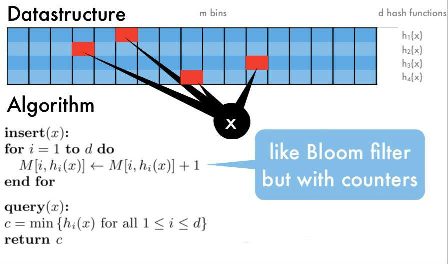

如何计算数据流中任意元素的频率？

这个问题也是大数据场景下的一个经典问题，称为频率估计(Frequency Estimation)问题。


### 方案1: HashMap

用一个HashMap记录每个元素的出现次数，每来一个元素，就把相应的计数器增1。这个方法在大数据的场景下不可行，因为元素太多，单机内存无法存下这个巨大的HashMap。


### 方案2: 数据分片 + HashMap

既然单机内存存不下所有元素，一个很自然的改进就是使用多台机器。假设有8台机器，每台机器都有一个HashMap，第1台机器只处理`hash(elem)%8==0`的元素，第2台机器只处理`hash(elem)%8==1`的元素，以此类推。查询的时候，先计算这个元素在哪台机器上，然后去那台机器上的HashMap里取出计数器。

方案2能够scale, 但是依旧是把所有元素都存了下来，代价比较高。

如果允许近似计算，那么有很多高效的近似算法，单机就可以处理海量的数据。下面讲几个经典的近似算法。


### 方案3: Count-Min Sketch

Count-Min Sketch 算法流程：

1. 选定d个hash函数，开一个 dxm 的二维整数数组作为哈希表
1. 对于每个元素，分别使用d个hash函数计算相应的哈希值，并对m取余，然后在对应的位置上增1，二维数组中的每个整数称为sketch
1. 要查询某个元素的频率时，只需要取出d个sketch, 返回最小的那一个（其实d个sketch都是该元素的近似频率，返回任意一个都可以，该算法选择最小的那个）



这个方法的思路和 Bloom Filter 比较类似，都是用多个hash函数来降低冲突。

* 空间复杂度`O(dm)`。Count-Min Sketch 需要开一个 `dxm` 大小的二位数组，所以空间复杂度是`O(dm)`
* 时间复杂度`O(n)`。Count-Min Sketch 只需要一遍扫描，所以时间复杂度是`O(n)`

Count-Min Sketch算法的优点是省内存，缺点是对于出现次数比较少的元素，准确性很差，因为二维数组相比于原始数据来说还是太小，hash冲突比较严重，导致结果偏差比较大。


### 方案4: Count-Mean-Min Sketch

Count-Min Sketch算法对于低频的元素，结果不太准确，主要是因为hash冲突比较严重，产生了噪音，例如当m=20时，有1000个数hash到这个20桶，平均每个桶会收到50个数，这50个数的频率重叠在一块了。Count-Mean-Min Sketch 算法做了如下改进：

* 来了一个查询，按照 Count-Min Sketch的正常流程，取出它的d个sketch
* 对于每个hash函数，估算出一个噪音，噪音等于该行所有整数(除了被查询的这个元素)的平均值
* 用该行的sketch 减去该行的噪音，作为真正的sketch
* 返回d个sketch的中位数

```java
class CountMeanMinSketch {
    // initialization and addition procedures as in CountMinSketch
    // n is total number of added elements
    long estimateFrequency(value) {
        long e[] = new long[d]
        for(i = 0; i < d; i++) {
            sketchCounter = estimators[i][ hash(value, i) ]
            noiseEstimation = (n - sketchCounter) / (m - 1)
            e[i] = sketchCounter – noiseEstimator
        }
        return median(e)
    }
}
```

Count-Mean-Min Sketch算法能够显著的改善在长尾数据上的精确度。


### 参考资料

* [数据流处理—摘要的艺术](http://chuansong.me/n/2035207)
* [大数据处理中基于概率的数据结构 - fxjwind - 博客园](http://www.cnblogs.com/fxjwind/p/3289221.html)
* [Probabilistic Data Structures for Web Analytics and Data Mining](https://dirtysalt.github.io/probabilistic-data-structures-for-web-analytics-and-data-mining.html)
