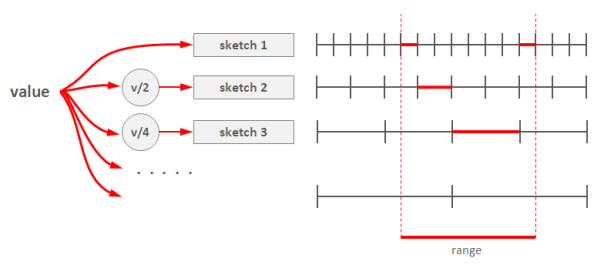

给定一个无限的整数数据流，如何查询在某个范围内的元素出现的总次数？例如数据库常常需要SELECT count(v) WHERE v >= l AND v < u。这个经典的问题称为范围查询(Range Query)。

### 方案1: Array of Count-Min Sketches

有一个简单方法，既然[Count-Min Sketch](https://soulmachine.gitbooks.io/system-design/content/cn/bigdata/frequency-estimation.html)可以计算每个元素的频率，那么我们把指定范围内所有元素的sketch加起来，不就是这个范围内元素出现的总数了吗？要注意，由于每个sketch都是近似值，多个近似值相加，误差会被放大，所以这个方法不可行。

解决的办法就是使用多个“分辨率”不同的Count-Min Sketch。第1个sketch每个格子存放单个元素的频率，第2个sketch每个格子存放2个元素的频率（做法很简答，把该元素的哈希值的最低位bit去掉，即右移一位，等价于除以2，再继续后续流程），第3个sketch每个格子存放4个元素的频率（哈希值右移2位即可），以此类推，最后一个sketch有2个格子，每个格子存放一半元素的频率总数，即第1个格子存放最高bit为0的元素的总次数，第2个格子存放最高bit为1的元素的总次数。Sketch的个数约等于`log(不同元素的总数)`。

* 插入元素时，算法伪代码如下，

		def insert(x):
		    for i in range(1, d+1):
		        M1[i][h[i](x)] += 1
		        M2[i][h[i](x)/2] += 1
		        M3[i][h[i](x)/4] += 1
		        M4[i][h[i](x)/8] += 1
		        # ...

* 查询范围[l, u)时，从粗粒度到细粒度，找到多个区间，能够不重不漏完整覆盖区间[l, u)，将这些sketch的值加起来，就是该范围内的元素总数。举个例子，给定某个范围，如下图所示，最粗粒度的那个sketch里找不到一个格子，就往细粒度找，最后找到第1个sketch的2个格子，第2个sketch的1个格子和第3个sketch的1个格子，共4个格子，能够不重不漏的覆盖整个范围，把4个红线部分的值加起来就是所求结果

    

### 参考资料

* [大数据处理中基于概率的数据结构 - fxjwind - 博客园](http://www.cnblogs.com/fxjwind/p/3289221.html)
* [Probabilistic Data Structures for Web Analytics and Data Mining](https://dirtysalt.github.io/probabilistic-data-structures-for-web-analytics-and-data-mining.html)
